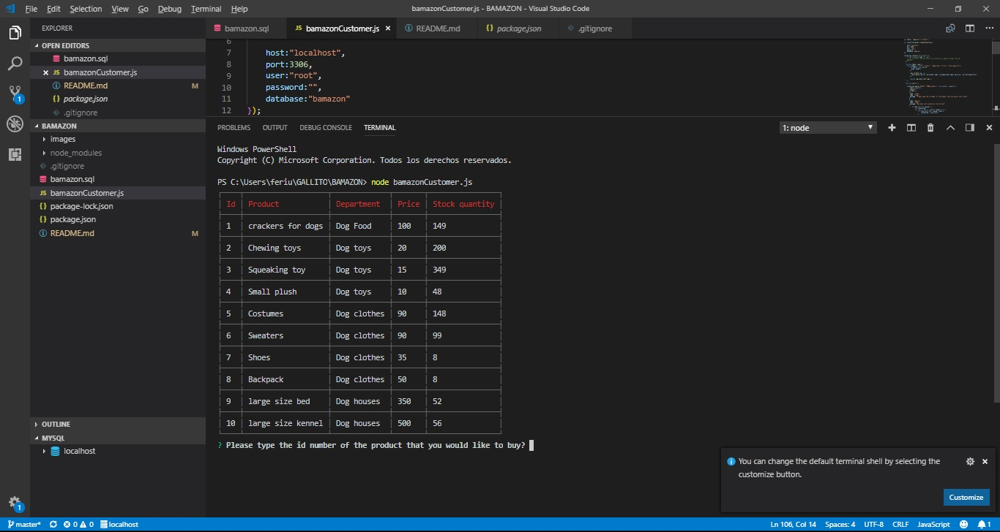
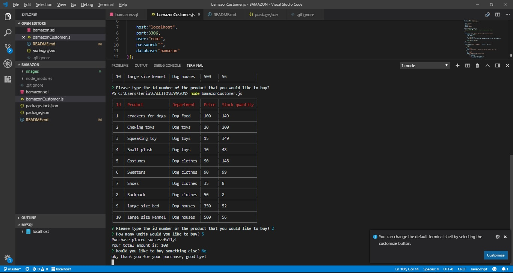
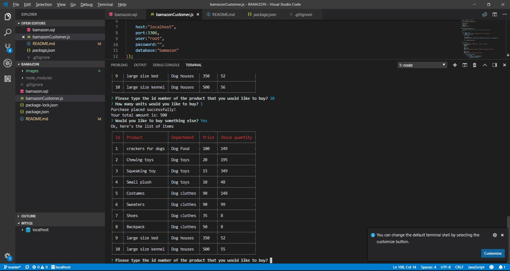
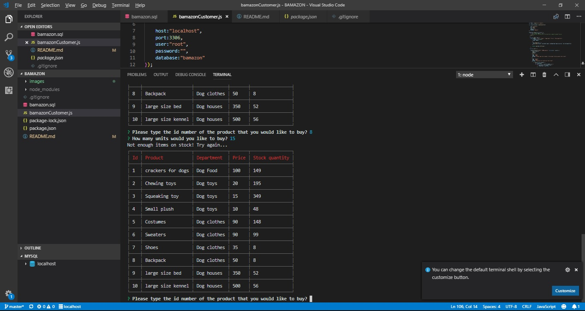

# BAMAZON
App with a database to search for products and buy according to the existing stock.

The app prompts users with two messages.

   * The first asks them the ID of the product they would like to buy.
         
   * The second message asks how many units of the product they would like to buy.
         

1. Once the customer has placed the order, the application checks if your store has enough of the product to meet the customer's request.
   * If it does, it will give you the total amount and substract the quantity to the stock. Then it will ask if you want to buy something else or not. 
         

   * If not, the app will log a phrase of `Insufficient quantity!`, and then prevent the order from going through.

         

2. However, if your store _does_ have enough of the product, it will fulfill the customer's order.

***